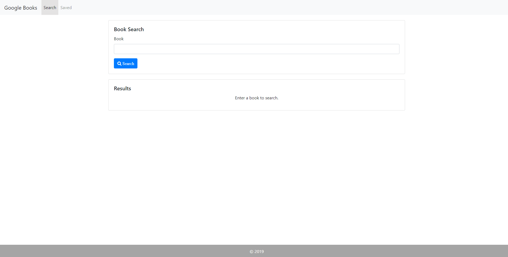
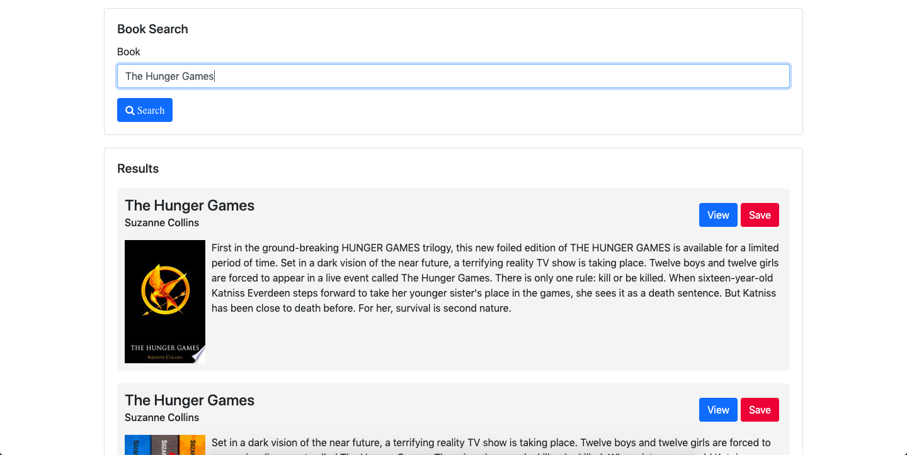
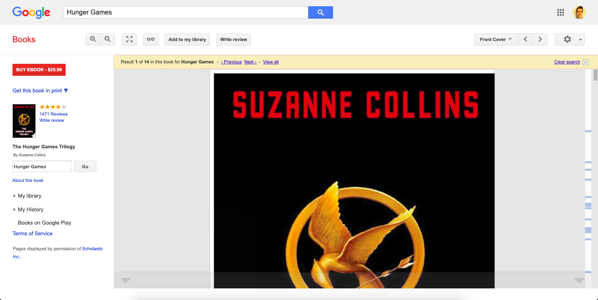
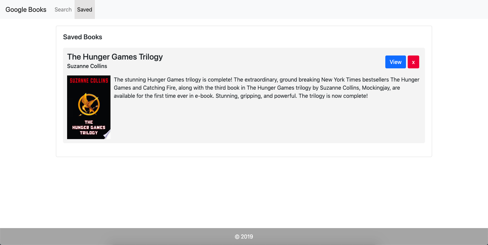
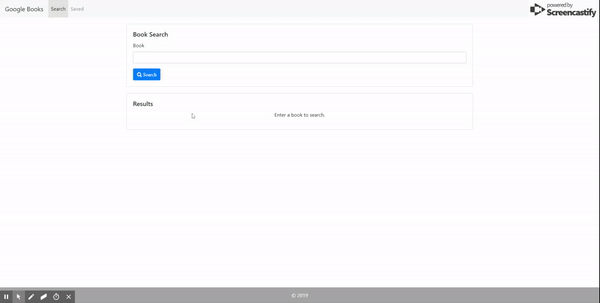

# Google Books Search

[Go To App](https://googlebookreactapp.herokuapp.com)

## Project Description

Google Books Search is a MERN Full Stack Web application that gives users the tool to search for books using the Google Books API. Upon entering the title of a book, the user is presented with all the search results together with their respective title, author(s), image, and description.

Clicking the "View" button will take the user to the Google Books page featuring that book.

If the user wants to save a book, they can simply click the Save button to save it locally. The saved book will appear in the "Saved" tab.

Users can always revisit this tab to see the saved books, even after closing the site. From here they have the option to "View", as well as delete the books from the saved list.

An example is shown in the gif below:

Local storage of the book items is handled with MongoDB through the mongoose package. Express router is used for fetching books from the Google Books API as well as from the local database. React Router is used to switch between the Search page and the Save page. A spinning icon is used to indicate server communication.

### Local Setup

1. Git clone or download zip folder.
1. Within the `/google-books` directory run `npm install`.
1. In a separate terminal run `mongod` to activate local MongoDB connection.
1. Run `npm start` and you should then be taken to a new browser running the app ([http://localhost:3000](http://localhost:3000)).

## Technologies

MongoDB, Express, React, Node, CSS3/Bootstrap
